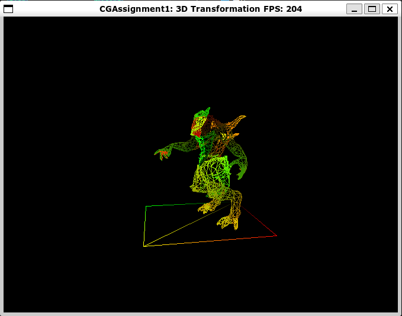
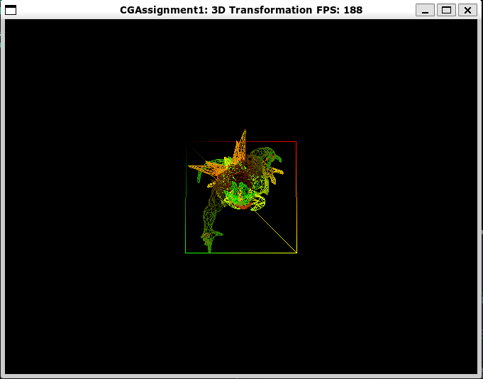
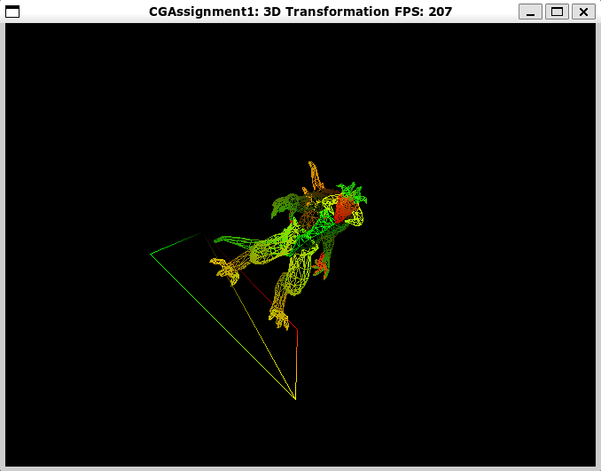
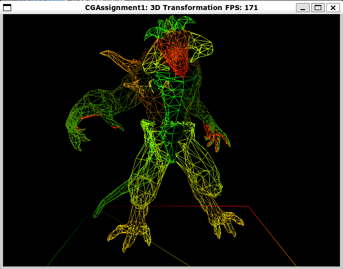
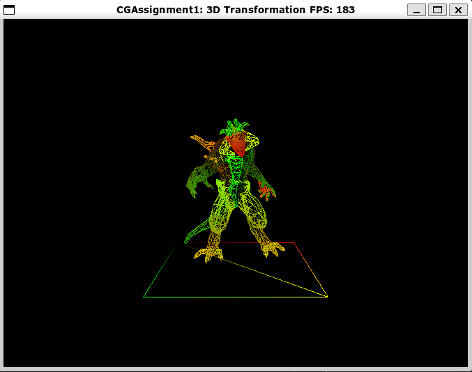
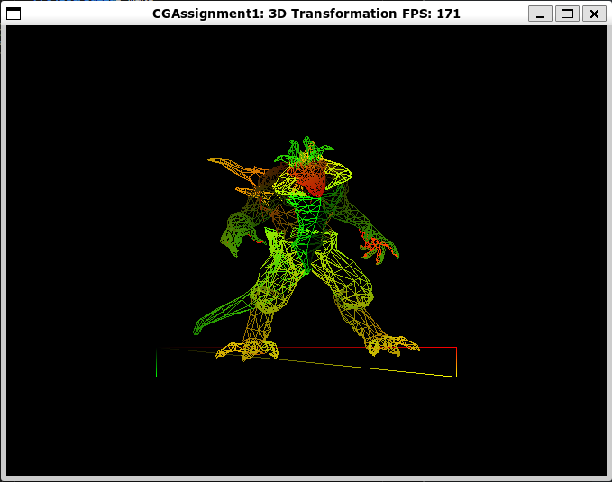

# Assignment 1: 3D Transformation

|  姓名  |   学号   |
| :----: | :------: |
| 黄灿彬 | 20337039 |

## Task 1 

**实现观察矩阵的计算**

观察矩阵的作用是将物体的顶点坐标从世界坐标系转换到摄像机坐标系，而 `calcViewMatrix` 函数的任务就是根据摄像机坐标 `camera`、目标点坐标 `target` 和 世界空间的上向量 `worldUp` 计算出观察矩阵。

首先，我们根据上述三个参数计算出摄像机坐标系的三个坐标轴的单位向量，要注意摄像机的朝向是摄像机坐标系的 $-z$ 方向：

```c++
glm::vec3 zAxis = glm::normalize(camera - target);
glm::vec3 xAxis = glm::normalize(glm::cross(worldUp, zAxis));
glm::vec3 yAxis = glm::cross(zAxis, xAxis);
```

然后，我们计算将摄像机坐标系重叠到世界坐标系的变换矩阵 $M$，它由两个矩阵复合而成，一个是将摄像机位置 $camera$ 平移到世界坐标系原点的变换矩阵 $T$，另一个是将摄像机坐标系坐标轴旋转到世界坐标系坐标轴方向的旋转矩阵 $R$：
$$
M=TR=\begin{bmatrix}
1	&0	&0	&camera_x\\
0	&1	&0	&camera_y\\
0	&0	&1	&camera_z\\
0	&0	&0	&1
\end{bmatrix}
\begin{bmatrix}
xAxis_x		&yAxis_x	&zAxis_x	&0\\
xAxis_y		&yAxis_y	&zAxis_y	&0\\
xAxis_z		&yAxis_z	&zAxis_z	&0\\
0			&0			&0			&1
\end{bmatrix}
$$
接着，为了求将世界坐标系中的物体坐标变换到摄像机坐标系下坐标的变换矩阵，需要求 $M$ 的逆矩阵，即：
$$
\begin{split}
vMat 
&= M^{-1}\\
&= R^{-1}T^{-1}\\
& =\begin{bmatrix}
xAxis_x		&xAxis_y	&xAxis_z	&0\\
yAxis_x		&yAxis_y	&yAxis_z	&0\\
zAxis_x		&zAxis_y	&zAxis_z	&0\\
0			&0			&0			&1
\end{bmatrix}
\begin{bmatrix}
1	&0	&0	&-camera_x\\
0	&1	&0	&-camera_y\\
0	&0	&1	&-camera_z\\
0	&0	&0	&1
\end{bmatrix}\\
&= \begin{bmatrix}
xAxis_x		&xAxis_y	&xAxis_z	&\boldsymbol{-xAxis}\cdot \boldsymbol{camera}\\
yAxis_x		&yAxis_y	&yAxis_z	&\boldsymbol{-yAxis}\cdot \boldsymbol{camera}\\
zAxis_x		&zAxis_y	&zAxis_z	&\boldsymbol{-zAxis}\cdot \boldsymbol{camera}\\
0	&0	&0	&1
\end{bmatrix}
\end{split}
$$
根据上述结果编写代码，要注意 `glm::mat4` 矩阵是列主序的：

```c++
glm::mat4 vMat = glm::mat4(1.0f);

vMat[0][0] = xAxis.x;
vMat[1][0] = xAxis.y;
vMat[2][0] = xAxis.z;
vMat[0][1] = yAxis.x;
vMat[1][1] = yAxis.y;
vMat[2][1] = yAxis.z;
vMat[0][2] = zAxis.x;
vMat[1][2] = zAxis.y;
vMat[2][2] = zAxis.z;
vMat[3][0] = -glm::dot(xAxis, camera);
vMat[3][1] = -glm::dot(yAxis, camera);
vMat[3][2] = -glm::dot(zAxis, camera);
```

## Task 2

**实现透视投影矩阵的计算**

投影矩阵的作用是把三维空间中的物体投影到二维平面。一个视锥体可以用六个参数表示 `left`、`right`、`bottom`、`top`、`near` 和 `far`，分别表示视锥体的六个面。

我们首先将视锥体中的点 $(x_e,y_e,z_e)$ 投影到视锥体的近平面上 $(x_p,y_p,-n)$ 处，则有：
$$
\begin{array}{l}
\frac{x_{p}}{x_{e}}=\frac{-near}{z_{e}} \rightarrow x_{p}=\frac{-near \cdot x_{e}}{z_{e}}=\frac{near \cdot x_{e}}{-z_{e}} \\
\frac{y_{p}}{y_{e}}=\frac{-near}{y_{e}} \rightarrow y_{p}=\frac{-near \cdot y_{e}}{z_{e}}=\frac{near \cdot y_{e}}{-z_{e}}
\end{array}
$$
上面两个式子分母都是 $-z_e$，这与在裁剪空间中对顶点做透视除法相对应。透视投影，然后做透视除法如下面两个公式所示：
$$
\begin{array}{c}
\left(\begin{array}{c}
x_{c l i p} \\
y_{c l i p} \\
z_{\text {clip }} \\
w_{c l i p}
\end{array}\right)=M_{\text {projection }} \cdot\left(\begin{array}{l}
x_{\text {eye }} \\
y_{\text {eye }} \\
z_{\text {eye }} \\
w_{\text {eye }}
\end{array}\right) \\
\left(\begin{array}{l}
x_{n d c} \\
y_{n d c} \\
z_{n d c}
\end{array}\right)=\left(\begin{array}{l}
x_{c l i p} / w_{c l i p} \\
y_{c l i p} / w_{c l i p} \\
z_{c l i p} / w_{c l i p}
\end{array}\right)
\end{array}
$$
为了便于构建矩阵，我们令裁剪空间中的 $w_{clip}=-z_e$，将除以 $-z_e$ 这一步放到透视除法去做，故目前透视矩阵变为：
$$
\left(\begin{array}{l}
x_{c} \\
y_{c} \\
z_{c} \\
w_{c}
\end{array}\right)=\left(\begin{array}{cccc}
\cdot & \cdot & \cdot & \cdot \\
\cdot & \cdot & \cdot & \cdot \\
\cdot & \cdot & \cdot & \cdot \\
0 & 0 & -1 & 0
\end{array}\right)\left(\begin{array}{l}
x_{e} \\
y_{e} \\
z_{e} \\
w_{e}
\end{array}\right)
$$
接着，我们要把视图空间中在视锥体内的点变换到标准化设备坐标中的立方体内，即 $x$ 轴方向从 $[left, right]$ 映射到 $[-1, 1]$，$y$ 轴方向从 $[bottom, top]$ 映射到 $[-1, 1]$。以 $x_p$ 为例，映射后坐标记为 $x_n$：
$$
\begin{split}
x_n
&=2{x_p-left\over right-left}-1\\
&={2x_p\over right-left}-{right-left\over right-left}\\
&={2{near\cdot x_e\over-z_e}\over right-left}-{right-left\over right-left}\\
&=\left .\left ({2near\over right-left}\cdot x_e+{right-left\over right-left}\cdot z_e \right ) \right /-z_e
\end{split}
$$
其中，$x_c={2near\over right-left}\cdot x_e+{right-left\over right-left}\cdot z_e$ 就是裁剪空间中的 $x$ 轴坐标。

同理，
$$
y_c={2near\over top-bottom}\cdot y_e+{top+bottom\over top-bottom}\cdot z_e
$$
现在，我们可以继续填充投影矩阵的前两行了：
$$
\left(\begin{array}{l}
x_{c} \\
y_{c} \\
z_{c} \\
w_{c}
\end{array}\right)=\left(\begin{array}{cccc}
{2near\over right-left} & 0 & {right+left\over right-left} & 0 \\
0 & {2near\over top-bottom} & {top+bottom\over top-bottom} & 0 \\
0 & 0 & A & B \\
0 & 0 & -1 & 0
\end{array}\right)\left(\begin{array}{l}
x_{e} \\
y_{e} \\
z_{e} \\
w_{e}
\end{array}\right)
$$
因为 $z$ 的投影与 $x_e$ 和 $y_e$ 无关，只与 $z_e$ 和 $w_e$ 有关，所以我们可以假设投影矩阵的第三行如上所示，其中 $A$ 和 $B$ 是未知数。

在视图空间中，$w_e=1$；在裁剪空间中，$w_c=-z_e$，故有：
$$
z_n={z_c\over w_c}={Az_e+B\over-z_e}
$$
由 $-near$ 处的 $z$ 值被映射到 $-1$，而 $-far$ 处的 $z$ 值被映射到 $1$，可得
$$
\begin{cases}
{-A\cdot near+B\over near}=-1\\
{-A\cdot far+B\over far}=1
\end{cases}
$$
解得
$$
A=-{far+near\over far-near}\\
B=-{2far\cdot near\over far-near}
$$
于是，我们得到
$$
M_{projection}=\left(\begin{array}{cccc}
{2near\over right-left} & 0 & {right+left\over right-left} & 0 \\
0 & {2near\over top-bottom} & {top+bottom\over top-bottom} & 0 \\
0 & 0 & -{far+near\over far-near} & -{2far\cdot near\over far-near} \\
0 & 0 & -1 & 0
\end{array}\right)
$$
上面的投影矩阵是一个通用的形式，在视图空间中的视锥体通常是关于 $x$ 和 $y$ 轴对称的，从而 $right=-left,top=-bottom$，故上式可以简化如下：
$$
M_{projection}=\left(\begin{array}{cccc}
{2near\over right-left} & 0 & 0 & 0 \\
0 & {2near\over top-bottom} & 0 & 0 \\
0 & 0 & -{far+near\over far-near} & -{2far\cdot near\over far-near} \\
0 & 0 & -1 & 0
\end{array}\right)
$$
另外，通常我们传入构建透视矩阵函数的参数是 $y$ 轴方向的视域角 $fovy$ 、屏幕的宽高比 $aspect$、近平面 $near$ 和原平面 $far$，注意到
$$
right-left=width=2\cdot near\cdot aspect\cdot\tan({fovy\over2})\\
top-bottom=height=2\cdot near\cdot\tan({fovy\over2})
$$
最终，我们得到
$$
M_{projection}=\left(\begin{array}{cccc}
{1\over aspect\cdot\tan(fovy/2)} & 0 & 0 & 0 \\
0 & {1\over \tan(fovy/2)} & 0 & 0 \\
0 & 0 & -{far+near\over far-near} & -{2far\cdot near\over far-near} \\
0 & 0 & -1 & 0
\end{array}\right)
$$
根据上述结果编写 `calcPerspProjectMatrix` 函数代码，要注意 `glm::mat4` 矩阵是列主序的：

```c++
glm::mat4 pMat = glm::mat4(1.0f);
float f = 1.0f / std::tan(fovy / 2.0f);

pMat[0][0] = f / aspect;
pMat[1][1] = f;
pMat[2][2] = -(far + near) / (far - near);
pMat[2][3] = -1.0f;
pMat[3][2] = -(2.0f * far * near) / (far-near);
```

## Task 3

**实现视口变换矩阵的计算**

视口变换矩阵的作用是把 $z=1$ 平面从 $[-1,1]^2$ 映射到 $[0,width]\times[0,height]$。

首先将物体绕 $x$ 轴翻转，对应的变换矩阵为
$$
\left(\begin{array}{cccc}
1 & 0 & 0 & 0\\
0 & -1 & 0 & 0\\
0 & 0 & 1 & 0\\
0 & 0 & 0 & 1
\end{array}\right)
$$
然后把原点平移到 $(1,1)$，对应的变换矩阵为
$$
\left(\begin{array}{cccc}
1 & 0 & 0 & 1\\
0 & 1 & 0 & 1\\
0 & 0 & 1 & 0\\
0 & 0 & 0 & 1
\end{array}\right)
$$
最后 $x$ 轴和 $y$ 轴方向分别放大 $width/2$ 和 $height/2$ 倍，对应的变换矩阵为
$$
\left(\begin{array}{cccc}
width/2 & 0 & 0 & 0\\
0 & height/2 & 0 & 0\\
0 & 0 & 1 & 0\\
0 & 0 & 0 & 1
\end{array}\right)
$$
把以上三个矩阵相乘得到视口变换矩阵
$$
\begin{split}
M_{view\_port}&=
\left(\begin{array}{cccc}
width/2 & 0 & 0 & 0\\
0 & height/2 & 0 & 0\\
0 & 0 & 1 & 0\\
0 & 0 & 0 & 1
\end{array}\right)
\left(\begin{array}{cccc}
1 & 0 & 0 & 1\\
0 & 1 & 0 & 1\\
0 & 0 & 1 & 0\\
0 & 0 & 0 & 1
\end{array}\right)
\left(\begin{array}{cccc}
1 & 0 & 0 & 0\\
0 & -1 & 0 & 0\\
0 & 0 & 1 & 0\\
0 & 0 & 0 & 1
\end{array}\right)\\
&=\left(\begin{array}{cccc}
width/2 & 0 & 0 & width/2\\
0 & -height/2 & 0& height/2\\
0 & 0 & 1 & 0\\
0 & 0 & 0 & 1
\end{array}\right)
\end{split}
$$
根据上述结果编写 `calcViewPortMatrix` 函数代码，要注意 `glm::mat4` 矩阵是列主序的：

```c++
glm::mat4 vpMat = glm::mat4(1.0f);
vpMat[0][0] = width / 2.0f;
vpMat[1][1] = -height / 2.0f;
vpMat[2][2] = 1.0f;
vpMat[3][0] = width / 2.0f;
vpMat[3][1] = height / 2.0f;
vpMat[3][2] = 1.0f;
```

完成以上三个任务后，编译运行程序，效果如下：



[视频](./效果/Task3.mp4)

## Task 4

**在 `main.cpp` 中修改代码，使得物体分别绕 $x$ 和 $z$ 轴旋转。**

在主函数的渲染循环中，可使用 `glm::rotage` 函数设置模型矩阵，从而使模型绕某一个坐标轴旋转。`glm::rotate` 函数接受三个参数，分别为模型矩阵、旋转角度、旋转轴，要使模型分别绕 $x$ 和 $z$ 轴旋转，只需把第三个参数分别设置为 `glm::vec3(1, 0, 0)` 和 `glm::vec3(0, 0, 1)`。

* 绕 $x$ 轴旋转：

    ```c++
    model_mat = glm::rotate(model_mat, (float)deltaTime * 0.001f, glm::vec3(1, 0, 0));
    ```

    

    [视频](./效果/Task4-绕x轴旋转.mp4)

* 绕 $z$ 轴旋转：

    ```c++
    model_mat = glm::rotate(model_mat, (float)deltaTime * 0.001f, glm::vec3(0, 0, 1));
    ```

    

    [视频](./效果/Task4-绕z轴旋转.mp4)

## Task 5

**让物体循环放大缩小，先放大 2 倍，再缩小至原大小。**

在渲染循环里，每一次迭代对物体的放大缩小操作都是在上一次迭代的大小的基础上进行的，因此我们需要一个变量 `scale` 记录目前物体相比于原来已经放大了多少倍，还有一个变量 `larger` 记录下一次迭代应该放大物体还是缩小物体。另外，每一帧渲染时间可能是不同的，为了让放大缩小随时间匀速进行，需要根据上一帧渲染时间 `deltaTime` 确定本次放大或缩小的倍数：

```c++
static float scale = 1.0f;
static bool larger = true;
if (larger) {
    scale += (float)deltaTime * 0.001f;
    model_mat = glm::scale(model_mat, 1.0f + glm::vec3((float)deltaTime * 0.001f));
} else {
    scale -= (float)deltaTime * 0.001f;
    model_mat = glm::scale(model_mat, 1.0f - glm::vec3((float)deltaTime * 0.001f));
}
if (scale > 2.0f) {
    larger = false;
} else if (scale < 1.0f) {
    larger = true;
}
```

效果如下：



[视频](./效果/task5.mp4)

## Task 6

**实现正交投影矩阵的计算。**

正交投影只需做简单的线性映射，$x$ 轴方向从 $[left, right]$ 映射到 $[-1, 1]$，$y$ 轴方向从 $[bottom, top]$ 映射到 $[-1, 1]$，$z$ 轴方向从 $[-near,-far]$ 投影到 $[-1,1]$。投影矩阵如下：
$$
M_{\text {projection }}=\left(\begin{array}{cccc}
\frac{2}{right-left} & 0 & 0 & -\frac{right+left}{right-left} \\
0 & \frac{2}{top-bottom} & 0 & -\frac{top+bottom}{top-bottom} \\
0 & 0 & \frac{-2}{far-near} & -\frac{far+near}{far-near} \\
0 & 0 & 0 & 1
\end{array}\right)
$$
由于视锥体关于 $x$ 和 $y$ 轴对称，投影矩阵可简化如下：
$$
M_{\text {projection }}=\left(\begin{array}{cccc}
\frac{2}{right-left} & 0 & 0 & 0 \\
0 & \frac{2}{top-bottom} & 0 & 0 \\
0 & 0 & \frac{-2}{far-near} & -\frac{far+near}{far-near} \\
0 & 0 & 0 & 1
\end{array}\right)
$$
根据以上推导结构编写代码：

```c++
glm::mat4 pMat = glm::mat4(1.0f);

pMat[0][0] = 2.0f / (right - left);
pMat[1][1] = 2.0f / (top - bottom);
pMat[2][2] = -2.0f / (far - near);
pMat[3][2] = -(far + near) / (far - near);
```

## Task 7

**分别尝试调用透视投影和正交投影函数，通过滚动鼠标的滚轮来拉近或拉远摄像机的位置，仔细体会这两种投影的差别。**

`main.cpp` 中有如下代码，默认使用的是透视投影，注释掉第 3 行，打开第 4 行即可使用正交投影。

```c++
// Task 6: try it with different kind of projection
{
    renderer->setProjectMatrix(TRRenderer::calcPerspProjectMatrix(45.0f, static_cast<float>(width) / height, 0.1f, 10.0f));
    //renderer->setProjectMatrix(TRRenderer::calcOrthoProjectMatrix(-2.0f, +2.0f, -2.0f, +2.0f, 0.1f, 10.0f));
}

```

* 透视投影：

    

    [视频](./效果/Task7-透视投影.mp4)

* 正交投影：

    

    [视频](./效果/Task7-正交投影.mp4)

两种投影的差别：

1. 透视投影有“近大远小”的效果，所以透视投影中模型底面的正方形左右两条边是不平行的，而正交投影中这两条边是平行的；
2. 从 `main.cpp` 中下面的代码可以看出，鼠标滚轮调整的是摄像机与模型的距离，而不是模型的大小或视野的大小。在透视投影中，调整鼠标滚轮能让画面中的模型放大缩小是因为透视投影有“近大远小”的效果，拉近摄像机与模型的距离会让模型看起来更大；而正交投影没有这种效果，所以调整鼠标滚轮的时候画面中好像并没有变化，但是不断滑动鼠标滚轮拉近距离直到摄像机穿过模型时，模型就在画面中消失了。

## Task 8

1. **请简述正交投影和透视投影的区别。**

    正交投影的裁剪空间是一个长方体，它将长方体之外的顶点裁剪掉，并将 3D 物体投影到 2D 平面，这种投影是一个线性变换，3D 物体上的相互平行的线段变换后仍然相互平行或者重叠。而透视投影的裁剪空间是一个四棱锥截去顶角，它同样将锥体之外的顶点裁剪掉，并将 3D 物体投影到 2D 平面，不过这种投影不是线性变换，原本相互平行的线投影后将在远处交于一点，这种投影能够产生“近大远小”的视觉效果，比正交投影更贴近于人眼的视觉效果。

2. **从物体局部空间的顶点到最终的屏幕空间上的顶点，需要经历哪几个空间的坐标系？裁剪空间下的顶点的 $w$ 值是哪个空间坐标下的 $z$ 值？它有什么空间意义？**

    从物体局部空间的顶点到最终的屏幕空间上的顶点，需要依次经历局部空间、世界空间、观察空间、裁剪空间和屏幕空间共 5 个空间的坐标系。

    由 [Task 2](# Task%202) 中的分析可知，裁剪空间下的顶点的 $w$ 值是观察空间坐标下的 $z$ 值，这个值的大小表示该顶点与摄像机在 $z$ 轴上的距离。

3. **经过投影变换之后，几何顶点的坐标值是被直接变换到了 NDC 坐标（即 $xyz$ 的值全部都在 $[-1,1]$ 范围内）吗？透视除法（Perspective Division）是什么？为什么要有这么一个过程？**

    经过投影变换之后，几何顶点的坐标值并没有直接变换到 NDC 坐标。由 [Task 2](# Task%202) 中的分析可知，将观察空间中的几何顶点坐标 $(x_e,y_e,z_e)$ 变换到裁剪空间下的 NDC 坐标 $(x_n,y_n,z_n)$ 都有一个除以 $-z_e$ 的步骤，我们把这一步放到透视除法中去做，所以投影变换只是将 $(x_e,y_e,z_e)$ 变换到裁剪空间下的一个齐次坐标 $(x_c,y_c,z_c,w_c)$，其中 $w_c=-z_e$。之后再做透视除法，把 $x_c,y_c,z_c$ 分别除以 $w_c$ 得到 NDC 坐标。由于 $z_e$ 代表顶点到摄像机在 $z$ 轴方向的距离，透视除法使得远处顶点的 $x$ 轴和 $y$ 轴坐标衰减比近处物体多，从而产生“近大远小”的t
