# Assignment 2: Rasterization & Z-buffering

|  姓名  |   学号   |
| :----: | :------: |
| 黄灿彬 | 20337039 |

## Task 1 

**实现 Bresenham 直线光栅化算法**

我们要光栅化从 $(x_0, y_0)$ 到 $(x_1, y_1)$ 的线段，不妨先假设
$$
\Delta x = x_1 - x_0 > 0 \\
\Delta y = y_1 - y_0 > 0 \\
m = {\Delta y \over \Delta x} \le 1
$$
这种情况下，Bresenham 算法遍历从 $x_0$ 到 $x_1$，确定应该取哪些点。

假设在第 $i$ 次迭代，我们已经取了点 $(\overline x_i, \overline y_i)$，那么接下来我们应该在 $(\overline x_i+1,\overline y_i)$ 和 $(\overline x + 1, \overline y + 1)$ 中选取距离线段与直线 $x=\overline x_i+1$ 的交点更近的点，如下图所示：

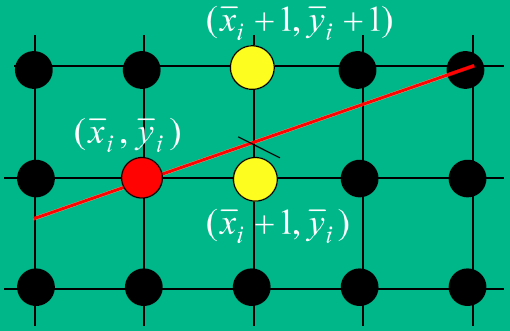

如下图所示，我们使用 $d_{upper}$ 和 $d_{lower}$ 来衡量这两个距离：

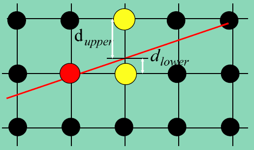

设线段所在直线为 $y=mx+b$，则
$$
d_{upper} = \overline y_i + 1 - y_{i+1} = \overline y_i + 1 - m (\overline x_i+1) - b \\
d_{lower} = y_{i+1} - \overline y_i = m (\overline x_i+1) + b - \overline y_i \\
d_{lower} - d_{upper} = 2 m (\overline x_i+1) - 2 \overline y_i + 2 b - 1
$$
现在我们根据 $d_{lower} - d_{upper}$ 的符号来选取所需的点。由于除法计算比较耗时，为了消去求 $m$ 过程中的除法运算，在两边乘上 $\Delta x$。由于最开始假设 $\Delta x>0$，所以乘上之后正负号不变。
$$
p_i = \Delta x ( d_{lower} - d_{upper} ) = 2 \overline x_i \Delta y - 2 \overline y_i \Delta x + c
$$
其中，$c=\Delta x(2b-1)+2\Delta y$。当 $p_i\le0$ 时，我们选择正右方的点，即 $\overline y_{i+1}=\overline y_i$；当 $p_i>0$ 时，我们选择右上方的点，即 $\overline y_{i+1}=\overline y_i+1$；

进一步地，由于
$$
\begin{split}
p_{i+1} - p_i
&= \left( 2 \left(\overline x_i + 1 \right) \Delta y - 2 \overline y_{i+1} \Delta x + c \right) - ( 2 \overline x_i \Delta y - 2 \overline y_i \Delta x + c ) \\
&= 2 \Delta y - 2 \Delta x (\overline y_{i+1} - \overline y_i) \\
&= \begin{cases}
	2 \Delta y, &p_i \le 0,\\
	2 \Delta y - 2 \Delta x, & p_i > 0.
\end{cases}
\end{split}
$$
所以，我们可以通过上一次得到的 $p_i$ 来计算下一个 $p_{i+1}$，从而简化运算：
$$
p_{i+1} = \begin{cases}
	p_i + 2 \Delta y, &p_i \le 0,\\
	p_i + 2 \Delta y - 2 \Delta x, & p_i > 0.
\end{cases}
$$
还有一个问题，怎么求最开始的 $p$ 值呢？注意到线段的起点和终点都是屏幕空间中的像素点，因此对于起点 $(\overline x_0,\overline y_0)=(x_0,y_0)$，有 $p_{-1}=\Delta x ( d_{lower} - d_{upper} )=-\Delta x$，故 $p_0=p_{-1}+2\Delta y=2\Delta y-\Delta x$（注意我们是用 $p_i$ 来确定 $x=\overline x_{i+1}$ 处应该选取哪个点）。

上面只是讨论了起点在终点的左下方且斜率小于 $1$ 的情况，接下来我们进行推广：

* 若斜率绝对值小于 1
    $$
    p_0 = 2 \Delta y - \Delta x\\
    p_{i+1} = \begin{cases}
    	p_i + 2 \Delta y, &p_i \le 0,\\
    	p_i + 2 \Delta y - 2 \Delta x, & p_i > 0.
    \end{cases}
    $$

    * 若起点在终点左边（$\Delta x > 0$），则从小到大遍历 $\overline x$；若起点在终点右边（$\Delta x < 0$），则从大到小遍历 $\overline x$；
    * 若起点在终点下方（$\Delta y > 0$），则当 $p_i\le0$ 时，$\overline y_{i+1}=\overline y_i$；当 $p_i>0$ 时，$\overline y_{i+1}=\overline y_i+1$；若起点在终点上方（$\Delta y < 0$），则当 $p_i\le0$ 时，$\overline y_{i+1}=\overline y_i$；当 $p_i>0$ 时，$\overline y_{i+1}=\overline y_i-1$；

* 若斜率绝对值大于 1
    $$
    p_0 = 2 \Delta x - \Delta y\\
    p_{i+1} = \begin{cases}
    	p_i + 2 \Delta x, &p_i \le 0,\\
    	p_i + 2 \Delta x - 2 \Delta y, & p_i > 0.
    \end{cases}
    $$

    * 若起点在终点下方（$\Delta y > 0$），则从小到大遍历 $\overline y$；若起点在终点上方（$\Delta y < 0$），则从大到小遍历 $\overline y$；
    * 若起点在终点左边（$\Delta x > 0$），则当 $p_i\le0$ 时，$\overline x_{i+1}=\overline x_i$；当 $p_i>0$ 时，$\overline x_{i+1}=\overline x_i+1$；若起点在终点右边（$\Delta x < 0$），则当 $p_i\le0$ 时，$\overline x_{i+1}=\overline x_i$；当 $p_i>0$ 时，$\overline x_{i+1}=\overline x_i-1$；

代码如下：

```C++
void TRShaderPipeline::rasterize_wire_aux(
    const VertexData &from,
    const VertexData &to,
    const unsigned int &screen_width,
    const unsigned int &screen_height,
    std::vector<VertexData> &rasterized_points)
{
    int dx = to.spos.x - from.spos.x;
    int dy = to.spos.y - from.spos.y;
    int stepX = 1, stepY = 1;

    if (dx < 0) {
        dx = -dx;
        stepX = -1;
    }
    if (dy < 0) {
        dy = -dy;
        stepY = -1;
    }

    int d2x = 2 * dx, d2y = 2 * dy;
    int d2yMinusD2x = d2y - d2x;
    int sx = from.spos.x, sy = from.spos.y;

    if (dy <= dx) {	// slope <= 1
        int flag = d2y - dx;
        for (int i = 0; i <= dx; i++) {
            auto tmp = VertexData::lerp(from, to, static_cast<double>(i) / dx);
            tmp.spos = glm::ivec2(sx, sy);
            if (tmp.spos.x >= 0 && tmp.spos.x < screen_width && tmp.spos.y >= 0 && tmp.spos.y < screen_height) {
                rasterized_points.push_back(tmp);
            }
            sx += stepX;
            if (flag < 0) {
                flag += d2y;
            } else {
                flag += d2yMinusD2x;
                sy += stepY;
            }
        }
    } else {	// slope > 1
        int flag = d2x - dy;
        for (int i = 0; i <= dy; i++) {
            auto tmp = VertexData::lerp(from, to, static_cast<double>(i) / dy);
            tmp.spos = glm::ivec2(sx, sy);
            if (tmp.spos.x >= 0 && tmp.spos.x < screen_width && tmp.spos.y >= 0 && tmp.spos.y < screen_height) {
                rasterized_points.push_back(tmp);
            }
            sy += stepY;
            if (flag < 0) {
                flag += d2x;
            } else {
                flag -= d2yMinusD2x;
                sx += stepX;
            }
        }
    }
}
```

效果如下：

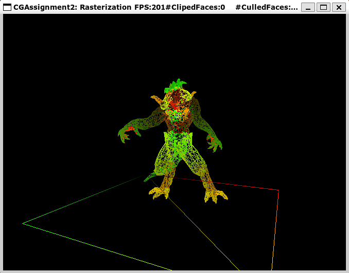

[视频](./Video/Task1.mp4)

## Task 2

**实现简单的齐次空间裁剪**

只保留三个顶点至少有一个在视锥体之内的三角形，即三个顶点中至少有一个的 $x$、$y$ 和 $z$ 坐标在 $[-w, w]$ 之间，而 $w$ 在 $[near,far]$ 之间。

代码如下：

```c++
if (
    v0.cpos.x >= -v0.cpos.w && v0.cpos.x <= v0.cpos.w &&
    v0.cpos.y >= -v0.cpos.w && v0.cpos.y <= v0.cpos.w &&
    v0.cpos.z >= -v0.cpos.w && v0.cpos.z <= v0.cpos.w &&
    v0.cpos.w >= m_frustum_near_far.x && v0.cpos.w <= m_frustum_near_far.y ||
    v1.cpos.x >= -v1.cpos.w && v1.cpos.x <= v1.cpos.w &&
    v1.cpos.y >= -v1.cpos.w && v1.cpos.y <= v1.cpos.w &&
    v1.cpos.z >= -v1.cpos.w && v1.cpos.z <= v1.cpos.w &&
    v1.cpos.w >= m_frustum_near_far.x && v1.cpos.w <= m_frustum_near_far.y ||
    v2.cpos.x >= -v2.cpos.w && v2.cpos.x <= v2.cpos.w &&
    v2.cpos.y >= -v2.cpos.w && v2.cpos.y <= v2.cpos.w &&
    v2.cpos.z >= -v2.cpos.w && v2.cpos.z <= v2.cpos.w &&
    v2.cpos.w >= m_frustum_near_far.x && v2.cpos.w <= m_frustum_near_far.y
) {
    return {v0, v1, v2};
} else {
    return {};
}

```

效果如下：

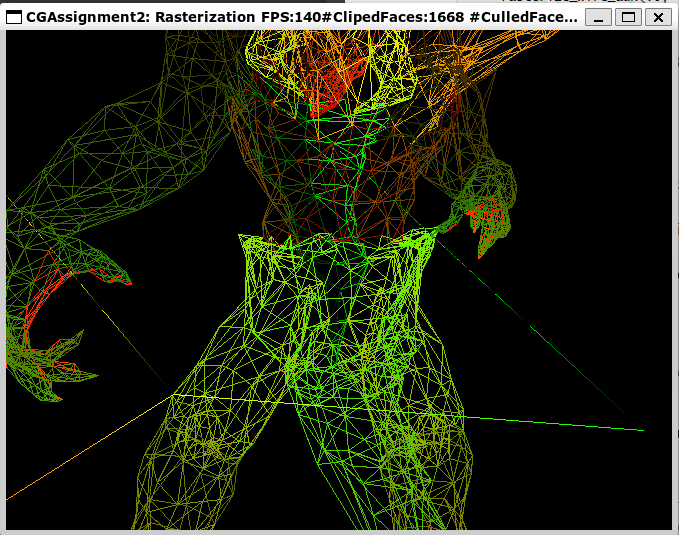

[视频](./Video/Task2.mp4)

## Task 3

**实现三角形的背向面剔除**

由于我们定义了逆时针环绕顺序为正面，所以只需取 $\Delta ABC$ 的两个边向量 $\overrightarrow{AB}$ 和 $\overrightarrow{BC}$ 进行叉乘，叉乘得到的向量的 $z$ 值为负说明为背向面三角形。

代码如下：

```c++
bool TRRenderer::isTowardBackFace(const glm::vec4 &v0, const glm::vec4 &v1, const glm::vec4 &v2) const {
    auto vec1 = glm::vec3(v1.x - v0.x, v1.y - v0.y, v1.z - v0.z);
    auto vec2 = glm::vec3(v2.x - v1.x, v2.y - v1.y, v2.z - v1.z);
    auto normal_vec = glm::cross(vec1, vec2);
    return normal_vec.z < 0;
}
```

另外，由于窗口过小，CulledFace 无法显示完整，因此在 `main.cpp` 中将窗口宽度改为 700。

剔除背向面三角形前：


`CulledFaces` 数值为 0，并且可以观察到背向面的三角形。

剔除背向面三角形后：

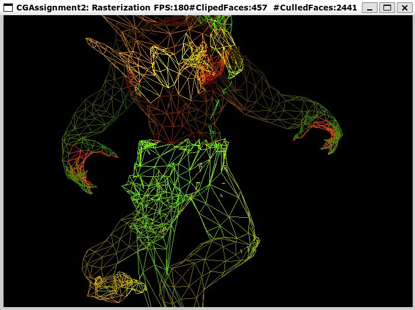

`CulledFaces` 数值不为 0，并且已经无法观察到背向面的三角形。

[视频](./Video/Task3.mp4)

## Task 4

**实现基于 Edge-function 的三角形填充算法**

* **使用包围盒缩小判断范围**

    渲染一个三角形时并不需要遍历屏幕上每个像素来判断它是否在三角形内，我们可以通过三角形顶点的坐标得到它的包围盒来缩小判断的范围。包围盒是一个四条边平行于行列的长方形，恰巧包围住这个三角形。计算包围盒四个边界的坐标时只需分别取三角形三个顶点横纵坐标的最大值和最小值即可：
    $$
    minX=\min(A_x,B_x,C_x)\\
    maxX=\max(A_x,B_x,C_x)\\
    minY=\min(A_y,B_y,C_y)\\
    maxY=\max(A_y,B_y,C_y)
    $$
    注意，我们要光栅化的三角形不一定三个顶点都在屏幕边界之内，因此我们可以根据屏幕边界缩小包围盒，排除掉屏幕之外的像素点：
    $$
    minX' = \max(minX, 0)\\
    maxX' = \min(maxX, width)\\
    minY' = \max(minY, 0)\\
    maxY' = \min(maxY, height)
    $$
    代码如下：

    ```c++
    void TRShaderPipeline::rasterize_fill_edge_function(
        const VertexData &v0,
        const VertexData &v1,
        const VertexData &v2,
        const unsigned int &screen_width,
        const unsigned int &screene_height,
        std::vector<VertexData> &rasterized_points)
    {
        // Calculate the bounding box of the triangle
        int minX = std::min(v0.spos.x, std::min(v1.spos.x, v2.spos.x));
        int maxX = std::max(v0.spos.x, std::max(v1.spos.x, v2.spos.x));
        int minY = std::min(v0.spos.y, std::min(v1.spos.y, v2.spos.y));
        int maxY = std::max(v0.spos.y, std::max(v1.spos.y, v2.spos.y));
    
        // Clamp the bounding box to the window
        minX = std::max(minX, 0);
        maxX = std::min(maxX, (int)screen_width - 1);
        minY = std::max(minY, 0);
        maxY = std::min(maxY, (int)screene_height - 1);
    
        // Todo: Determine whether each pixel inside the bounding box is inside the triangle 
        // and lerp the vertex attributes
    }
    ```

* **使用叉积判断点是否在三角形内部**

    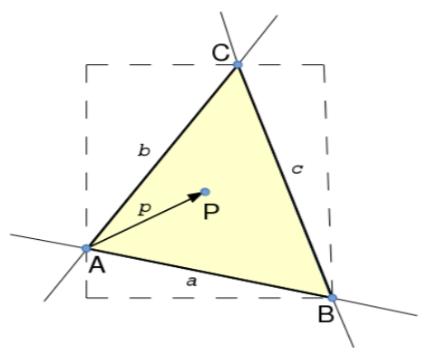

    如图所示，若 $P$ 在三角形 $ABC$ 内部，则 $\overrightarrow{AP}$ 在 $\overrightarrow{AB}$ 的左边，$\overrightarrow{BP}$ 在 $\overrightarrow{BC}$ 的左边，$\overrightarrow{CP}$ 在 $\overrightarrow{CA}$ 的左边，向量的位置关系可以使用叉乘来判断：

    $$
    F_{AB}(P) = \overrightarrow{AB} \times \overrightarrow{AP} = \overrightarrow{AB}_x \overrightarrow{AP}_y - \overrightarrow{AB}_y \overrightarrow{AP}_x \le 0\\
    F_{BC}(P) = \overrightarrow{BC} \times \overrightarrow{BP} = \overrightarrow{BC}_x \overrightarrow{BP}_y - \overrightarrow{BC}_y \overrightarrow{BP}_x \le 0\\
    F_{CA}(P) = \overrightarrow{CA} \times \overrightarrow{CP} = \overrightarrow{CA}_x \overrightarrow{CP}_y - \overrightarrow{CA}_y \overrightarrow{CP}_x \le 0
    $$
    $F_{AB}(P)$、$F_{BC}(P)$ 和 $F_{CA}(P)$ 称为边界函数。
    
* **对边界函数计算的优化**

    把顶点坐标代入 $F_{AB}(P)$，得
    $$
    \begin{split}
    F_{AB}(P)
    &= \overrightarrow{AB}_x \overrightarrow{AP}_y - \overrightarrow{AB}_y \overrightarrow{AP}_x\\
    &=(B_x-A_x)(P_y-A_y)-(B_y-A_y)(P_x-A_x)\\
    &=(A_y-B_y)P_x+(B_x-A_x)P_y+(A_xB_y-A_yB_x)
    \end{split}
    $$
    可以看到，这个函数对于 $P_x$ 和 $P_y$ 都是线性的，所以相邻两个像素之间的差是固定值：
    $$
    F_{AB}(P_{x}+1,P_y)-F_{AB}(P_x,P_y)=A_y-B_y\\
    F_{AB}(P_x,P_y+1)-F_{AB}(P_x,P_y)=B_x-A_x
    $$
    同理
    $$
    F_{BC}(P)=(B_y-C_y)P_x+(C_x-B_x)P_y+(B_xC_y-B_yC_x)\\
    F_{BC}(P_{x}+1,P_y)-F_{BC}(P_x,P_y)=B_y-C_y\\
    F_{BC}(P_x,P_y+1)-F_{BC}(P_x,P_y)=C_x-B_x\\
    F_{CA}(P)=(C_y-A_y)P_x+(A_x-C_x)P_y+(C_xA_y-C_yA_x)\\
    F_{CA}(P_{x}+1,P_y)-F_{CA}(P_x,P_y)=C_y-A_y\\
    F_{CA}(P_x,P_y+1)-F_{CA}(P_x,P_y)=A_x-C_x\\
    $$
    那么我们在遍历的时候根本就不需要每次计算三个边界函数值了，只需要计算起点处的三个初始值，每移动一格就加上固定差值即可。

    代码如下：

    ```c++
    // Calculate some components of the edge functions
    int i0 = v0.spos.y - v1.spos.y;
    int i1 = v1.spos.y - v2.spos.y;
    int i2 = v2.spos.y - v0.spos.y;
    int j0 = v1.spos.x - v0.spos.x;
    int j1 = v2.spos.x - v1.spos.x;
    int j2 = v0.spos.x - v2.spos.x;
    int k0 = v0.spos.x * v1.spos.y - v0.spos.y * v1.spos.x;
    int k1 = v1.spos.x * v2.spos.y - v1.spos.y * v2.spos.x;
    int k2 = v2.spos.x * v0.spos.y - v2.spos.y * v0.spos.x;
    
    // Calculate the edge functions of the first pixel
    int fy0 = k0 + i0 * minX + j0 * minY;
    int fy1 = k1 + i1 * minX + j1 * minY;
    int fy2 = k2 + i2 * minX + j2 * minY;
    
    // Scan the pixels in the bounding box
    for (int y = minY; y <= maxY; ++y) {
        int fx0 = fy0, fx1 = fy1, fx2 = fy2;
        for (int x = minX; x <= maxX; ++x) {
            // Judge if the pixel is in the triangle
            if (fx0 <=0 && fx1 <= 0 && fx2 <= 0) {
                // Todo: Lerp the vertex attributes
            }
            // Calculate the edge function of the next pixel
            fx0 += i0;
            fx1 += i1;
            fx2 += i2;
        }
        fy0 += j0;
        fy1 += j1;
        fy2 += j2;
    }
    ```

* **使用重心坐标进行插值**

    通过上面的算法得到位于三角形内部的像素点之后，我们还需要通过三角形三个顶点的信息插值得到其内部像素点的信息。我们使用三角形的重心坐标进行插值。

    三角形内点 $P$ 的重心坐标 $(\alpha,\beta,\gamma)$ 满足：
    $$
    P = \alpha A + \beta B + \gamma C \\
    \alpha + \beta + \gamma = 1
    $$
    而 $\alpha$、$\beta$ 和 $\gamma$ 的取值等于顶点 $A$、$B$ 和 $C$ 对应的小三角形面积与整个三角形面积之比，如下所示：

    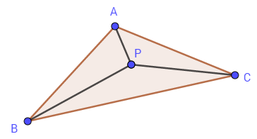
    $$
    \alpha = {S_{\Delta BCP} \over S_{\Delta ABP} + S_{\Delta BCP} + S_{\Delta CAP}}\\
    \beta = {S_{\Delta CAP} \over S_{\Delta ABP} + S_{\Delta BCP} + S_{\Delta CAP}}\\
    \gamma = {S_{\Delta ABP} \over S_{\Delta ABP} + S_{\Delta BCP} + S_{\Delta CAP}}\\
    $$
    三角形的面积等于两个边向量叉乘的一半。回头看看边函数 $F_{AB}(P)$、$F_{BC}(P)$ 和 $F_{CA}(P)$ 的定义，我们发现，三个小三角形的面积正好分别是三个边函数值的一半，所以我们可以通过边函数的值求得点 $P$ 的重心坐标：
    $$
    \alpha = {F_{BC}(P) \over F_{AB}(P) + F_{BC}(P) + F_{CA}(P)}\\
    \beta = {F_{CA}(P) \over F_{AB}(P) + F_{BC}(P) + F_{CA}(P)}\\
    \gamma = {F_{AB}(P) \over F_{AB}(P) + F_{BC}(P) + F_{CA}(P)}
    $$
    由于 $\Delta ABC$ 的面积是固定的，我们并不需要对每个点都计算一遍三个边函数的和，只需在最开始把第一个点的三个边函数的值相加求得倒数 $\Delta$，后面每个点的边函数值乘以 $\Delta$ 即可得到重心坐标。

*   完整代码如下：

    ```c++
    void TRShaderPipeline::rasterize_fill_edge_function(
        const VertexData &v0,
        const VertexData &v1,
        const VertexData &v2,
        const unsigned int &screen_width,
        const unsigned int &screene_height,
        std::vector<VertexData> &rasterized_points)
    {
        // Calculate the bounding box of the triangle
        int minX = std::min(v0.spos.x, std::min(v1.spos.x, v2.spos.x));
        int maxX = std::max(v0.spos.x, std::max(v1.spos.x, v2.spos.x));
        int minY = std::min(v0.spos.y, std::min(v1.spos.y, v2.spos.y));
        int maxY = std::max(v0.spos.y, std::max(v1.spos.y, v2.spos.y));
    
        // Clamp the bounding box to the window
        minX = std::max(minX, 0);
        maxX = std::min(maxX, (int)screen_width - 1);
        minY = std::max(minY, 0);
        maxY = std::min(maxY, (int)screene_height - 1);
    
        // Calculate some components of the edge functions
        int i0 = v0.spos.y - v1.spos.y;
        int i1 = v1.spos.y - v2.spos.y;
        int i2 = v2.spos.y - v0.spos.y;
        int j0 = v1.spos.x - v0.spos.x;
        int j1 = v2.spos.x - v1.spos.x;
        int j2 = v0.spos.x - v2.spos.x;
        int k0 = v0.spos.x * v1.spos.y - v0.spos.y * v1.spos.x;
        int k1 = v1.spos.x * v2.spos.y - v1.spos.y * v2.spos.x;
        int k2 = v2.spos.x * v0.spos.y - v2.spos.y * v0.spos.x;
    
        // Calculate the edge functions of the first pixel
        int fy0 = k0 + i0 * minX + j0 * minY;
        int fy1 = k1 + i1 * minX + j1 * minY;
        int fy2 = k2 + i2 * minX + j2 * minY;
    
        // Delta is twice of the area of the triangle
        int delta = fy0 + fy1 + fy2;
        float deltaInverse = 1.0 / delta;
    
        // Scan the pixels in the bounding box
        for (int y = minY; y <= maxY; ++y) {
            int fx0 = fy0, fx1 = fy1, fx2 = fy2;
            for (int x = minX; x <= maxX; ++x) {
                // Judge if the pixel is in the triangle
                if (fx0 <=0 && fx1 <= 0 && fx2 <= 0) {
                    // Lerp the vertex attributes
                    auto tmp = VertexData::barycentricLerp(v0, v1, v2, glm::vec3(fx1 * deltaInverse, fx2 * deltaInverse, fx0 * deltaInverse));
                    tmp.spos.x = x;
                    tmp.spos.y = y;
                    rasterized_points.push_back(tmp);
                }
                // Calculate the edge function of the next pixel
                fx0 += i0;
                fx1 += i1;
                fx2 += i2;
            }
            fy0 += j0;
            fy1 += j1;
            fy2 += j2;
        }
    }
    ```

* 效果如下：

    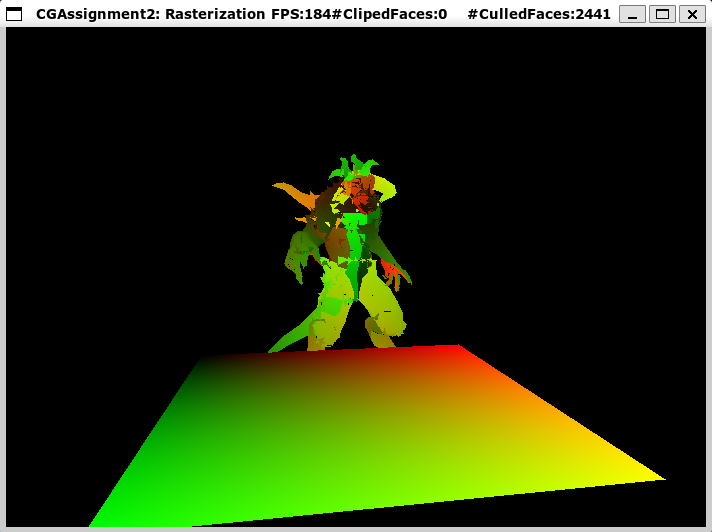

    [视频](./Video/Task4.mp4)

## Task 5

**实现深度测试**

为了体现正确的三维前后遮挡关系，在执行片段着色器之前要先将当前片元的 `cpos.z` 与当前深度缓冲的深度值进行比较，只有当片元的 `cpos.z` 值更小的时候才对片元运行片段着色器并将颜色和深度值写入缓冲：

```c++
TRShaderPipeline::VertexData::aftPrespCorrection(points);
if (points.cpos.z < m_backBuffer->readDepth(points.spos.x, points.spos.y)) {
    glm::vec4 fragColor;
    m_shader_handler->fragmentShader(points, fragColor);
    m_backBuffer->writeColor(points.spos.x, points.spos.y, fragColor);
    m_backBuffer->writeDepth(points.spos.x, points.spos.y, points.cpos.z);
}
```

效果如下：

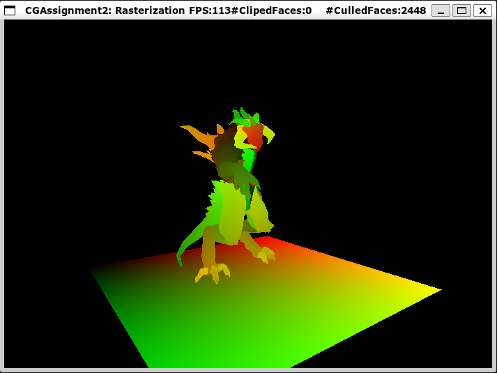

[视频](./Video/Task5.mp4)

## Task 6

**谈谈遇到的问题、困难和体会**

* 问题 & 困难：

    * Task 1 的 [参考资料](http://yangwc.com/2019/05/01/SoftRenderer-Rasterization/) 只介绍了起点在终点左下方且斜率小于 1 的线段的光栅化，对于其他情形只用了 1 句话简单带过，并且没有说明初始的 $p$ 值怎么求得。最终我通过对算法的理解，自行梳理出了算法对所有情况的推广还有求得初始 $p$ 值的方法。

    * Task 4 的 [参考资料](https://zhuanlan.zhihu.com/p/344018798) 中根本没有提到“Edge-function”或“边函数”，看完还是不懂边函数算法是什么。我自行在网上搜索参考资料，最终参考了 [图形学底层探秘 - 更现代的三角形光栅化与插值算法的实现与优化](https://zhuanlan.zhihu.com/p/140926917)，但是这篇文章的推导过程存在一些笔误，于是我根据它的方法自行整理了算法推导过程。

    * 我完成了 Task 4 之后发现每个三角形中都有一些点没有渲染出来：

        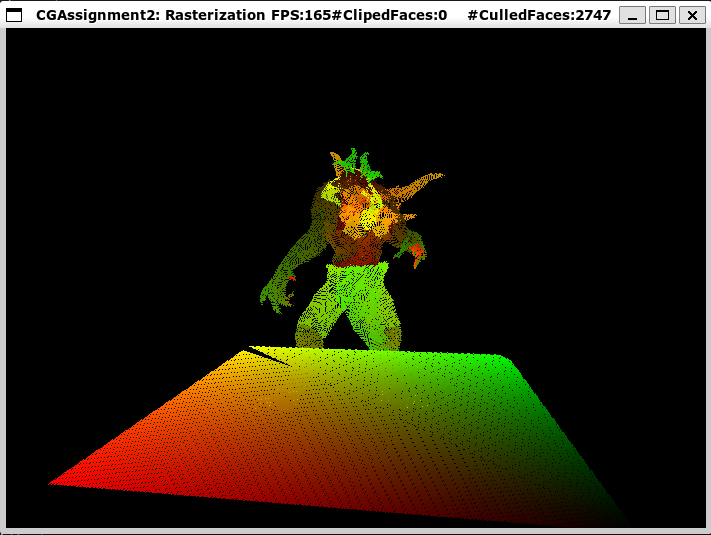

        原因是我通过中心插值后没有将得到的点的屏幕坐标重新赋值为当前点，因为在插值函数 `TRShaderPipeline::VertexData::barycentricLerp()` 中，通过三个顶点的坐标插值得到当前点坐标之后并没有进行四舍五入，而是直接舍去小数部分，这样会使一部分点的屏幕坐标跟之前的点重合而没有被渲染出来：

        ```c++
        result.spos.x = w.x * v0.spos.x + w.y * v1.spos.x + w.z * v2.spos.x;
        result.spos.y = w.x * v0.spos.y + w.y * v1.spos.y + w.z * v2.spos.y;
        ```

        在插值得到 `tmp` 之后重新将 `tmp.spos.x` 和 `tmp.spos.y` 赋值为当前坐标就好了。

    * 在解决上面的问题之后，我又发现三角形边界处的颜色没有平滑过渡，这跟实验要求中的结果图不同。原因是我的重心坐标写错了：

        ```c++
        auto tmp = VertexData::barycentricLerp(
            v0,
            v1,
            v2,
            glm::vec3(fx0 * deltaInverse, fx1 * deltaInverse, fx2 * deltaInverse)
        );
        ```

        这里的 `fx0`、`fx1` 和 `fx2` 分别是边函数 $F_{AB}(P)$、$F_{BC}(P)$ 和 $F_{CA}(P)$，重心坐标 $(\alpha,\beta,\gamma)$ 分别对应 $S_{\Delta BCP}$、$S_{\Delta CAP}$ 和 $S_{\Delta ABP}$，故应该分别对应边函数 `fx1`、`fx2` 和 `fx0`。改正之后：

        ```c++
        auto tmp = VertexData::barycentricLerp(
            v0,
            v1,
            v2,
            glm::vec3(fx1 * deltaInverse, fx2 * deltaInverse, fx0 * deltaInverse)
        );
        ```

* 体会：我一开始上网看了很多资料都无法理解边函数算法，于是我从头开始整理算法的推导过程，整理完之后发现算法的主要思想还是比较简单的，但是根据算法编写代码的过程中又遇到了许多细节问题，这些问题需要小心考虑，最终才能实现正确的算法。

## Task 7

**实现更为精细的其次空间三角形裁剪**

在 Task 2 中，我们已经裁剪掉了三个顶点都在视锥体之外的三角形。现在，我们要将部分在视锥体内的三角形的视锥体之外部分裁剪掉。

在其次空间下，视锥体由 6 个超平面组成：$w=x,w=-x,w=y,w=-y,w=z,w=-z$，另外，为了防止做透视除法时出现除零错误，再增加一个 $w=10^{-5}$ 平面的裁剪。

先考虑一条线段和一个超平面。以超平面 $w=10^{-5}$ 为例，若点 $P(x_1,y_1,z_1,w_1)$、$Q(x_2,y_2,z_2,w_2)$ 分别在超平面的两侧，则需把它们中在超平面之外的裁剪掉，同时插值得到线段 $PQ$ 与超平面的交点 $I$：
$$
I=P+t(Q-P)\\
\Rightarrow w_1+t(w_2-w_1)=10^{-5}\\
\Rightarrow t={10^{-5}-w_1\over w_2-w_1}
$$
我们可以对所有线段求出 $t$ 值，如果 $t\in(0,1)$，说明线段与超平面有交点，需要进行裁剪和插值，否则不需要裁剪。

同理可以求出超平面 $w=x,w=-x,w=y,w=-y,w=z,w=-z$ 对应的 $t$ 值分别为
$$
t_{-x}={w_1+x_1\over w_1+x_1-w_2-x_2}\\
t_x={w_1-x_1\over w_1-x_1-w_2+x_2}\\
t_{-y}={w_1+y_1\over w_1+y_1-w_2-y_2}\\
t_y={w_1-y_1\over w_1-y_1-w_2+y_2}\\
t_{-z}={w_1+z_1\over w_1+z_1-w_2-z_2}\\
t_z={w_1-z_1\over w_1-z_1-w_2+z_2}\\
$$
接下来考虑一个凸多边形和一个超平面。假设有一个按逆时针顺序定义的凸多边形 $ABCDE$，它的某些边与超平面有交点，我们依次遍历它的每条边 $AB$、$BC$、$CD$、$DE$ 和 $EA$：如果该边与超平面有交点，把交点放入列表 $l$；如果这条边的终点在超平面内侧，也放入 $l$。最后 $l$ 中的顶点按序围成的凸多边形就是经过该超平面裁剪后的凸多边形。

现在考虑所有超平面。我们只需让凸多边形（刚开始时是三角形）依次经历每个超平面的裁剪，最后得到的凸多边形就是原三角形在视锥体内的部分了。

代码较长，下面以超平面 $w=10^{-5}$ 为例：

```c++
auto vertices = std::vector<TRShaderPipeline::VertexData>{v0, v1, v2};
std::vector<TRShaderPipeline::VertexData> vertices1;
for (int j = 0; j < vertices.size(); j++) {
    // The start and end of the edge
    int k = (j + 1) % vertices.size();
    auto &start = vertices[j].cpos;
    auto &end = vertices[k].cpos;

    // If the edge and the plane intersect, save the intersection point
    float weight = (1e-5 - start.w) / (end.w - start.w);
    if (weight > 0 && weight < 1) {
        auto newVertex = TRShaderPipeline::VertexData::lerp(
            vertices[j], 
            vertices[k], 
            weight
        );
        vertices1.push_back(newVertex);
    }

    // If the end of the edge is inside the clipping space, save it
    if (end.w >= 1e-5) {
        vertices1.push_back(vertices[k]);
    }
}
```

效果如下：

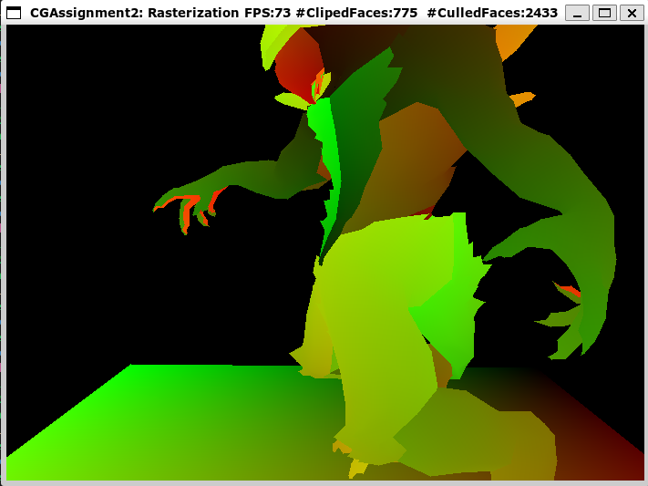

[视频](./Video/Task7.mp4)

