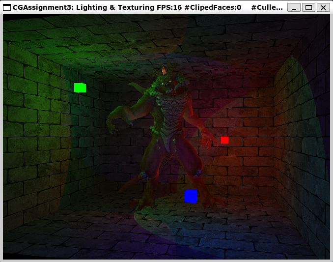

# Assignment 3: Lighting & Texturing

|  姓名  |   学号   |
| :----: | :------: |
| 黄灿彬 | 20337039 |

## Task 1 实现纹理的最近邻采样算法

只需将纹理坐标 `uv` 从 $[0,1]\times[0,1]$ 映射到 $[0,width-1]\times[0,height-1]$，然后再四舍五入为整数即可（浮点数加上 0.5 在舍去小数点后部分即可实现四舍五入），代码如下：

```C++
int u = uv.x * (texture.getWidth() - 1) + 0.5;
int v = uv.y * (texture.getHeight() - 1) + 0.5;
texture.readPixel(u, v, r, g, b, a);
```

效果如下：


[视频](./Video/Task1.mp4)

## Task 2 实现 Phong 光照模型

### 光的衰减

光的强度会随着光线传播距离的增长而逐渐衰减，我们可以通过下面的公式计算衰减值：

$$
F_{att}={1\over K_c+K_ld+K_q d^2}
$$

其中，$d$ 为片段与光源的距离，$K_c$、$K_l$ 和 $K_q$ 分别为常数项、一次项和二次项。当三个参数都取 1 时该函数的图像如下（注意 $d>0$）：


可以看到，$K_c$ 使得 $F_{att}\le1$，一次项和二次项使得光的衰减先快后慢。

三个参数在代码中分别对应 `light.attenuation` 的三个分量，代码如下：

```C++
float distance = glm::length(light.lightPos - fragPos);
attenuation = 1.0f / (light.attenuation.x + light.attenuation.y * distance + light.attenuation.z * distance * distance);
```

### Phong 光照模型

现实世界中，每个物体有自己的颜色，光源也有颜色，而我们看到的颜色是光照射到物体后物体反射的颜色（物体“本身的颜色”表示它多大程度地反射每种颜色的光）。为了模拟这种现象，用 RGB 值表示颜色，我们把光源的 RGB 值与物体的 RGB 值分别相乘，所得到的就是这个物体所反射的颜色。

自然界的光照非常复杂，我们用 Phong 光照模型进行简化近似，它的照明公式如下：

$$
I=K_aI_a+K_dI_e\cos\theta+K_sI_e\cos^n\gamma
$$

等式右边的三项分别表示环境光、漫反射光和镜面高光，片段呈现的颜色是这三种颜色的组合。三种颜色值的计算将在后面分别介绍。

当有多个点光源时，我们需要分别计算每个光源被片段反射后的颜色，乘以相应衰减值，再相加，代码如下：

```C++
for (size_t i = 0; i < m_point_lights.size(); ++i)
{
    const auto &light = m_point_lights[i];
    glm::vec3 lightDir = glm::normalize(light.lightPos - fragPos);
    glm::vec3 ambient, diffuse, specular;
    float attenuation = 1.0f;
    {
        // caculate ambient
        ...

        // caculate diffuse
        ...

        // caculate specular
        ...

        // attenuation
        float distance = glm::length(light.lightPos - fragPos);
        attenuation = 1.0f / (light.attenuation.x + light.attenuation.y * distance + light.    attenuation.z * distance * distance);
    }
    fragColor.x += (ambient.x + diffuse.x + specular.x) * attenuation;
    fragColor.y += (ambient.y + diffuse.y + specular.y) * attenuation;
    fragColor.z += (ambient.z + diffuse.z + specular.z) * attenuation;
}
```

### 环境光

我们用片段的环境光颜色 $K_a$ 乘以光源的颜色 $I_a$ 来模拟环境光，代码如下：

```C++
ambient = amb_color * light.lightColor;
```

效果如下：


### 漫反射光


如上图所示，一束光线照射到物体，当入射光垂直于物体表面时，亮度较高；入射光越倾斜，亮度越低。为了实现这种效果，我们计算入射光方向向量 $\boldsymbol I$ 和片段法向量 $\boldsymbol n$ 的夹角 $\theta$ 的余弦，再将它与片段漫反射颜色 $K_d$ 和光源颜色 $I_e$ 相乘。我们用 $\boldsymbol I$ 和 $\boldsymbol n$ 两个单位向量点乘来计算它们夹角的预先。注意到可能会有光源照射到片段背面的情况，此时 $\cos \theta<0$，应将其置为 $0$。

代码如下：

```C++
float diff = glm::max(glm::dot(normal, lightDir), 0.0f);
diffuse = dif_color * diff * light.lightColor;
```

效果如下：


### 镜面高光

镜面光照决定于表面的反射特性。如果我们把物体表面设想为一面镜子，那么当观察者的视线与光的反射光线之间的夹角 $\gamma$ 越小，看到的光越亮。我们用如下公式来模拟这种特性：

$$
I_{specular}=K_sI_e\cos^n\gamma
$$

其中，$K_s$ 是物体镜面高光颜色，$I_e$ 是光源颜色，$n$ 表示反光度，由物体的特性决定：一个物体的反光度越高，反射光的能力越强，散射得越少，高光点就会越小。

代码如下：

```C++
glm::vec3 reflectDir = glm::reflect(-lightDir, normal);
float spec = glm::pow(glm::max(glm::dot(viewDir, reflectDir), 0.0f), m_shininess);
specular = spe_color * spec * light.lightColor;
```

效果如下：


### 综合效果

将三种光相加，得到最终 Phong 光照模型的效果如下：


[视频](Video/Task2.mp4)

## Task 3 实现 Blinn-Phong 光照模型

Phong 的镜面高光再一些情况下会出现问题，特别是物体反光度很低时，会导致大片（粗糙的）高光区域；当观察向量和反射向量间的夹角大于 90 度时镜面光分量会变为 0，使得高光的边缘出现明显的断层。

为了解决这个问题，Blinn-Phong 不适用反射向量，而是光线与视线的半程向量。当半程向量与法线向量越接近时，镜面光分量就越大。


计算半程向量的方法为

$$
\boldsymbol{H}={\boldsymbol{L}+\boldsymbol{V}\over\|\boldsymbol{L}+\boldsymbol{V}\|}
$$

代码如下：

```C++
glm::vec3 halfwayDir = glm::normalize(lightDir + viewDir);
float spec = glm::pow(glm::dot(halfwayDir, normal), m_shininess);
specular = spe_color * spec * light.lightColor;
```

只保留镜面高光的效果如下：


整体效果如下：


[视频](Video/Task3.mp4)

## Task 4 纹理的双线性插值纹理过滤采样

前面我们直接采用四舍五入的方法确定纹理采样的像素值，当物体里摄像机很近的时候可以看到明显的像素块，如下图中怪兽的手指：


下面我们实现更为平滑的双线性插值纹理过滤，即采样像素点四周的四个纹素，并在 $x$ 和 $y$ 两个方向进行双线性插值。

设像素点坐标为 $(u,v)$，它周围四个纹素坐标为 $(u_1,v_1)$、$(u_2,v_2)$、$(u_1,v_2)$ 和 $(u_2,v_2)$，纹素值记为 $f(\cdot)$。

首先计算插值权重

$$
\begin{split}
w_1&=\left(u-u_1\right)\left(v-v_1\right)\\
w_2&=\left(u_2-u\right)\left(v-v_1\right)\\
w_3&=\left(u-u_1\right)\left(v_2-v\right)\\
w_4&=\left(u_2-u\right)\left(v_2-v\right)
\end{split}
$$

然后计算插值结果

$$
f(u,v)=w_1f(u_1,v_1)+w_2f(u_2,v_1)+w_3f(u_1,v_2)+w_4f(u_2,v_2)
$$

代码如下：

```C++
// Get the texture coordinates of the four surrounding texels
float u = uv.x * (texture.getWidth() - 1);
float v = uv.y * (texture.getHeight() - 1);
int u1 = u;
int v1 = v;
int u2 = u1 + 1;
int v2 = v1 + 1;
// Get the four surrounding texels
unsigned char r1, g1, b1, a1;
unsigned char r2, g2, b2, a2;
unsigned char r3, g3, b3, a3;
unsigned char r4, g4, b4, a4;
texture.readPixel(u1, v1, r1, g1, b1, a1);
texture.readPixel(u2, v1, r2, g2, b2, a2);
texture.readPixel(u1, v2, r3, g3, b3, a3);
texture.readPixel(u2, v2, r4, g4, b4, a4);
// Get the weights
float w1 = (u2 - u) * (v2 - v);
float w2 = (u - u1) * (v2 - v);
float w3 = (u2 - u) * (v - v1);
float w4 = (u - u1) * (v - v1);
// Get the weighted average
unsigned char r = w1 * r1 + w2 * r2 + w3 * r3 + w4 * r4;
unsigned char g = w1 * g1 + w2 * g2 + w3 * g3 + w4 * g4;
unsigned char b = w1 * b1 + w2 * b2 + w3 * b3 + w4 * b4;
unsigned char a = w1 * a1 + w2 * a2 + w3 * a3 + w4 * a4;
constexpr float denom = 1.0f / 255.0f;
return glm::vec4(r, g, b, a) * denom;
```

效果如下：


可以看到不再有马赛克状的像素块了。

[视频](Video/Task4.mp4)

## Task 5 聚光灯

聚光是位于环境中某个位置的光源，它只朝一个特定方向而不是所有方向照射光线。这样的结果就是只有在聚光方向的特定半径内的物体才会被照亮，其它的物体都会保持黑暗。


* `LightDir`：从片段指向光源的向量。
* `SpotDir`：聚光所指向的方向。
* `Phi` $\phi$：指定了聚光半径的切光角。落在这个角度之外的物体都不会被这个聚光所照亮。
* `Theta` $\theta$：`LightDir` 向量和 `SpotDir` 向量之间的夹角。在聚光内部的话 $\theta$ 值应该比 $\phi$ 值小。

我们在 Task 3 的基础上进行修改，使得在聚光范围之外的片段只保留环境光。

将原本的点光源改成聚光灯需要经历如下步骤：

1. 在 `TRShadingState.h` 的 `TRPoingLight` 类中增加 `direction` 和 `cutOff` 两个属性：

   ```C++
   class TRPointLight
   {
   public:
   	glm::vec3 lightPos;//Note: world space position of light source
   	glm::vec3 attenuation;
   	glm::vec3 lightColor;
       glm::vec3 direction;
       float cutOff;
       TRPointLight(glm::vec3 pos, glm::vec3 atten, glm::vec3 color, glm::vec3 direction, float cutOff)
   		: lightPos(pos), attenuation(atten), lightColor(color), direction(direction), cutOff(cutOff) {}
   };
   ```
2. 在 `TRShadingPipeline` 和 `TRShader` 两个类的 `addPointLight` 函数中加入上述两个属性；
3. 在 `main.cpp` 中将光源的方向设为位置向量取反，这样光源就会照向世界坐标系的原点，`cutOff` 值设为 `0.9659f`，这是 15 度角的余弦值：

   ```C++
   int redLightIndex = renderer->addPointLight(redLightPos, glm::vec3(1.0, 0.7, 1.8), glm::vec3(1.9f, 0.0f, 0.0f), -redLightPos, 0.9659f);
   int greenLightIndex = renderer->addPointLight(greenLightPos, glm::vec3(1.0, 0.7, 1.8), glm::vec3(0.0f, 1.9f, 0.0f), -greenLightPos, 0.9659f);
   int blueLightIndex = renderer->addPointLight(blueLightPos, glm::vec3(1.0, 0.7, 1.8), glm::vec3(0.0f, 0.0f, 1.9f), -blueLightPos, 0.9659f);
   ```

4. 在模型变换部分改变光源方向：

    ```C++
    redLightModelMat = glm::rotate(glm::mat4(1.0f), (float)deltaTime * 0.0008f, glm::vec3(0, 1, 0));
    redLightPos = glm::vec3(redLightModelMat * glm::vec4(redLightPos, 1.0f));
    redLightMesh->setModelMatrix(glm::translate(glm::mat4(1.0f), redLightPos));
    redLight.lightPos = redLightPos;
    redLight.direction = -redLightPos;
    greenLightModelMat = glm::rotate(glm::mat4(1.0f), (float)deltaTime * 0.0008f, glm::vec3(1, 1, 1));
    greenLightPos = glm::vec3(greenLightModelMat * glm::vec4(greenLightPos, 1.0f));
    greenLightMesh->setModelMatrix(glm::translate(glm::mat4(1.0f), greenLightPos));
    greenLight.lightPos = greenLightPos;
    greenLight.direction = -greenLightPos;
    blueLightModelMat = glm::rotate(glm::mat4(1.0f), (float)deltaTime * 0.0008f, glm::vec3(-1, 1, 1));
    blueLightPos = glm::vec3(blueLightModelMat * glm::vec4(blueLightPos, 1.0f));
    blueLightMesh->setModelMatrix(glm::translate(glm::mat4(1.0f), blueLightPos));
    blueLight.lightPos = blueLightPos;
    blueLight.direction = -blueLightPos;
    ```

聚光灯照向怪兽效果如下：



[视频](./Video/Task5-1.mp4)

聚光灯照向墙壁效果如下：


[视频](Video/Task5-2.mp4)
