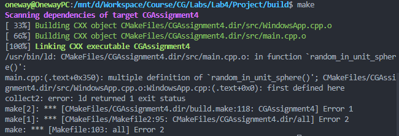

# Assignment 4: Ray Tracing

|  姓名  |   学号   |
| :----: | :------: |
| 黄灿彬 | 20337039 |

## Task 1 完成射线类和简单的摄像机构建，并渲染一个渐变的蓝色天空背景图

### 射线类

射线的表示：

$$
\boldsymbol{P}(t)=\boldsymbol{A}+t\boldsymbol{b}
$$

其中，$\boldsymbol A$ 为射线的起点，$\boldsymbol b$ 是射线的方向向量。

根据射线的表示在 `ray.h` 中建立射线类：

```C++
#ifndef RAY_H
#define RAY_H

#include "vec3.h"

class ray {
public:
    ray() {}
    ray(const point3 &origin, const vec3 &direction) :
        orig(origin), dir(direction) {}

    vec3 origin() const { return orig; }
    vec3 direction() const { return dir; }
    vec3 at(float t) const { return orig + t * dir; }

    point3 orig;
    vec3 dir;
};

#endif
```

### 构建摄像机

光线追踪通过让光线通过像素来计算它们最终进入人眼时的颜色，主要步骤如下：

1. 计算从眼睛到像素的射线；
2. 计算射线与哪些物体相交；
3. 计算交点的颜色。

首先我们需要创建一个虚拟视口，视口的宽高比等于图像的宽高比。我们把视口的高设为 2 个单位长度，把投影点到投影平面的距离设为 1 个单位长度，摄像机坐标设为 $(0,0,0)$：


代码如下：

```C++
auto viewport_height = 2.0;
auto viewport_width = aspect_ratio * viewport_height;
auto focal_length = 1.0;
auto origin = point3(0, 0, 0);
auto horizontal = vec3(viewport_width, 0, 0);
auto vertical = vec3(0, viewport_height, 0);
auto lower_left_corner = origin - horizontal / 2 - vertical / 2 - vec3(0, 0, focal_length);
```

### 渲染渐变蓝色天空背景

我们写一个根据 $y$ 轴坐标返回从白到蓝渐变色的函数：

```C++
color ray_color(const ray &r)
{
    vec3 unit_direction = unit_vector(r.direction());
    auto t = 0.5 * (unit_direction.y() + 1.0);
    return (1.0 - t) * color(1.0, 1.0, 1.0) + t * color(0.5, 0.7, 1.0);
}
```

然后在渲染循环中调用它获取当前像素颜色：

```C++
auto u = double(i) / (image_width - 1);
auto v = double(j) / (image_height - 1);
ray r(origin, lower_left_corner + u * horizontal + v * vertical - origin);
color pixel_color = ray_color(r);
write_color(i, j, pixel_color);
```

效果如下：


## Task2 渲染一个简单的球形物体

### 添加一个球体

设球心为 $\boldsymbol{C}=(C_x,C_y,C_z)$，球的半径为 $r$，则球面上的点 $\boldsymbol P$ 可以用如下方程表示：

$$
(\boldsymbol{P} - \boldsymbol{C})^2=r^2
$$

为了求出射线 $\boldsymbol{P}(t)=\boldsymbol{A}+t\boldsymbol{b}$ 与球面是否有交点，解方程：

$$
(\boldsymbol{A}+t\boldsymbol{b}-\boldsymbol{C})^2=r^2
$$

这是一个关于 $t$ 的一元二次方程，我们可以用判别式判断其是否有解。

我们在 $z$ 轴的 $-1$ 处放一个小球，并把与之相交的光线染成红色：

```C++
color ray_color(const ray &r)
{
    if (hit_sphere(point3(0, 0, -1), 0.5, r))
        return color(1, 0, 0);
    vec3 unit_direction = unit_vector(r.direction());
    auto t = 0.5 * (unit_direction.y() + 1.0);
    return (1.0 - t) * color(1.0, 1.0, 1.0) + t * color(0.5, 0.7, 1.0);
}

bool hit_sphere(const point3 &center, double radius, const ray &r)
{
    vec3 oc = r.origin() - center;
    auto a = r.direction().length_squared();
    auto b = 2.0 * dot(oc, r.direction());
    auto c = oc.length_squared() - radius * radius;
    auto discriminant = b * b - 4 * a * c;
    return (discriminant > 0);
}
```

效果如下：


但是这样做存在一个问题，我们没有区分物体是在我们面前还是背后（如果方程的解 $t<0$，那么物体在我们背后）。

### 表面法线

球体上点 $\boldsymbol P$ 处的表面法线可以用 $\boldsymbol{P}-\boldsymbol{C}$ 表示，我们通过把法向量的 $x,y,z$ 坐标映射到 $[0,1]$ 并解释为 RGB 值来可视化这些法线：

```C++
color ray_color(const ray &r)
{
    auto t = hit_sphere(point3(0, 0, -1), 0.5, r);
    if (t > 0.0) {
        vec3 N = unit_vector(r.at(t) - vec3(0, 0, -1));
        return 0.5 * color(N.x() + 1, N.y() + 1, N.z() + 1);
    }
    vec3 unit_direction = unit_vector(r.direction());
    t = 0.5 * (unit_direction.y() + 1.0);
    return (1.0 - t) * color(1.0, 1.0, 1.0) + t * color(0.5, 0.7, 1.0);
}

double hit_sphere(const point3 &center, double radius, const ray &r)
{
    vec3 oc = r.origin() - center;
    auto a = r.direction().length_squared();
    auto b = 2.0 * dot(oc, r.direction());
    auto c = oc.length_squared() - radius * radius;
    auto discriminant = b * b - 4 * a * c;
    if (discriminant < 0) {
        return -1.0;
    } else {
        return (-b - sqrt(discriminant)) / (2.0 * a);
    }
}
```

效果如下：


### 简化判断射线与球面相交的代码

上面我们用求根公式求解一元二次方程来判断射线与球面是否相交，我们可以对求根公式进行简化来减少计算量：

令 $h={b\over2}$

$$
\begin{split}
&\frac{-b \pm \sqrt{b^{2}-4 a c}}{2 a} \\
=&\frac{-2 h \pm \sqrt{(2 h)^{2}-4 a c}}{2 a} \\
=&\frac{-2 h \pm 2 \sqrt{h^{2}-a c}}{2 a} \\
=&\frac{-h \pm \sqrt{h^{2}-a c}}{a}
\end{split}
$$

简化后的代码如下：

```C++
double hit_sphere(const point3 &center, double radius, const ray &r)
{
    vec3 oc = r.origin() - center;
    auto a = r.direction().length_squared();
    auto half_b = dot(oc, r.direction());
    auto c = oc.length_squared() - radius * radius;
    auto discriminant = half_b * half_b - a * c;
    if (discriminant < 0) {
        return -1.0;
    } else {
        return (-half_b - sqrt(discriminant)) / a;
    }
}
```

### `hittable` 抽象类

`hittable` 抽象类有一个 `hit` 函数，它计算射线位于 `t_min` 和 `t_max` 之间的部分是否与对象相交，如果相交，则把法向量等信息存储在一个记录里：

```C++
struct hit_record {
    point3 p;
    vec3 normal;
    double t;
};

class hittable {
public:
    virtual bool hit(const ray& r, double t_min, double t_max, hit_record& rec) const = 0;
};
```

我们让球体类继承自 `hittable` 类：

```C++
class sphere : public hittable {
public:
    sphere() {}
    sphere(point3 cen, double r) : center(cen), radius(r) {};

    virtual bool hit(const ray& r, double t_min, double t_max, hit_record& rec) const override;

public:
    point3 center;
    double radius;
};

bool sphere::hit(const ray& r, double t_min, double t_max, hit_record& rec) const {
    vec3 oc = r.origin() - center;
    auto a = r.direction().length_squared();
    auto half_b = dot(oc, r.direction());
    auto c = oc.length_squared() - radius * radius;

    auto discriminant = half_b * half_b - a * c;
    if (discriminant < 0) return false;
    auto sqrtd = sqrt(discriminant);

    // Find the nearest root that lies in the acceptable range.
    auto root = (-half_b - sqrtd) / a;
    if (root < t_min || t_max < root) {
        root = (-half_b + sqrtd) / a;
        if (root < t_min || t_max < root)
            return false;
    }

    rec.t = root;
    rec.p = r.at(rec.t);
    vec3 outward_normal = (rec.p - center) / radius;

    return true;
}
```

### 正面和背面

在前面的代码中，表面法线总是从球体的内部指向外部，无论射线是从内部射向球面还是从外部射向球面的。这样，当法线和射线方向相反时，说明射线是从物体外部射入的；当法线和射线方向相同时，说明射线是从物体内部射出的，通过射线和法向量做点乘就可以判断正反面。

但是，如果我们想让法线总是指向射线入射的一侧，那么就需要有一个额外的变量来存储射线是从哪一侧射入的：

```C++
struct hit_record {
    point3 p;
    vec3 normal;
    double t;
    bool front_face;

    inline void set_face_normal(const ray& r, const vec3& outward_normal) {
        front_face = dot(r.direction(), outward_normal) < 0;
        normal = front_face ? outward_normal : -outward_normal;
    }
};

bool sphere::hit(const ray& r, double t_min, double t_max, hit_record& rec) const {
    ...

    rec.t = root;
    rec.p = r.at(rec.t);
    vec3 outward_normal = (rec.p - center) / radius;
    rec.set_face_normal(r, outward_normal);

    return true;
}
```

### `hittable` 对象的列表

```C++
class hittable_list : public hittable {
public:
    hittable_list() {}
    hittable_list(shared_ptr<hittable> object) { add(object); }

    void clear() { objects.clear(); }
    void add(shared_ptr<hittable> object) { objects.push_back(object); }

    virtual bool hit(
        const ray& r, double t_min, double t_max, hit_record& rec) const override;

public:
    std::vector<shared_ptr<hittable>> objects;
};

bool hittable_list::hit(const ray& r, double t_min, double t_max, hit_record& rec) const {
    hit_record temp_rec;
    bool hit_anything = false;
    auto closest_so_far = t_max;

    for (const auto& object : objects) {
        if (object->hit(r, t_min, closest_so_far, temp_rec)) {
            hit_anything = true;
            closest_so_far = temp_rec.t;
            rec = temp_rec;
        }
    }

    return hit_anything;
}
```

### 常用常量和函数

我们在头文件 `rtweekend.h` 中定义无穷大和 $\pi$ 等常量和一些函数：

```C++
#ifndef RTWEEKEND_H
#define RTWEEKEND_H

#include <cmath>
#include <limits>
#include <memory>
#include <cstdlib>

// Usings
using std::shared_ptr;
using std::make_shared;
using std::sqrt;

// Constants
const double infinity = std::numeric_limits<double>::infinity();
const double pi = 3.1415926535897932385;

// Utility Functions
inline double degrees_to_radians(double degrees) {
    return degrees * pi / 180.0;
}

inline double random_double() {
    // Returns a random real in [0,1).
    return rand() / (RAND_MAX + 1.0);
}

inline double random_double(double min, double max) {
    // Returns a random real in [min,max).
    return min + (max-min)*random_double();
}

// Common Headers
#include "ray.h"
#include "vec3.h"

#endif
```

然后修改 `main.cpp`：

```C++
void rendering()
{
    ...

    // World
    hittable_list world;
    world.add(make_shared<sphere>(point3(0, 0, -1), 0.5));
    world.add(make_shared<sphere>(point3(0, -100.5, -1), 100));

    ...

    // Render
    for (int j = image_height - 1; j >= 0; j--)
    {
        for (int i = 0; i < image_width; i++)
        {
            auto u = double(i) / (image_width - 1);
            auto v = double(j) / (image_height - 1);
            ray r(origin, lower_left_corner + u * horizontal + v * vertical - origin);
            color pixel_color = ray_color(r, world);
            write_color(i, j, pixel_color);
        }
    }

    ...
}

color ray_color(const ray &r, const hittable& world)
{
    hit_record rec;
    if (world.hit(r, 0, infinity, rec)) {
        return 0.5 * (rec.normal + color(1, 1, 1));
    }
    vec3 unit_direction = unit_vector(r.direction());
    auto t = 0.5 * (unit_direction.y() + 1.0);
    return (1.0 - t) * color(1.0, 1.0, 1.0) + t * color(0.5, 0.7, 1.0);
}

```

效果如下：


### 反走样

创建一个 `camera` 类来管理虚拟摄像机和场景采样任务：

```C++
class camera {
public:
    camera() {
        auto aspect_ratio = 16.0 / 9.0;
        auto viewport_height = 2.0;
        auto viewport_width = aspect_ratio * viewport_height;
        auto focal_length = 1.0;

        origin = point3(0, 0, 0);
        horizontal = vec3(viewport_width, 0, 0);
        vertical = vec3(0, viewport_height, 0);
        lower_left_corner = origin - horizontal / 2 - vertical / 2 - vec3(0, 0, focal_length);
    }

    ray get_ray(double u, double v) const {
        return ray(origin, lower_left_corner + u * horizontal + v * vertical - origin);
    }

private:
    point3 origin;
    point3 lower_left_corner;
    vec3 horizontal;
    vec3 vertical;
};
```

为了缓解物体边缘的“锯齿效应”，我们向一个像素内发射多条光线，采样得到多个颜色值然后取平均。在 `main.cpp` 的渲染循环中，我们每个像素采样 100 次并把颜色值累加：

```C++
// Render
for (int j = image_height - 1; j >= 0; j--) {
    for (int i = 0; i < image_width; i++) {
        color pixel_color(0, 0, 0);
        for (int s = 0; s < samples_per_pixel; s++) {
            auto u = (i + random_double()) / (image_width - 1);
            auto v = (j + random_double()) / (image_height - 1);
            ray r = cam.get_ray(u, v);
            pixel_color += ray_color(r, world);
        }
        write_color(i, j, pixel_color, samples_per_pixel);
    }
}
```

在 `write_color` 函数中，把颜色值取平均：

```C++
void write_color(int x, int y, color pixel_color, int samples_per_pixel) {
    // Divide the color by the number of samples
    auto scale = 1.0 / samples_per_pixel;
    pixel_color *= scale;

    // Note: x -> the column number, y -> the row number
    gCanvas[y][x] = pixel_color;
}
```

效果如下：

| 反走样前                                 | 反走样后                                 |
| ---------------------------------------- | ---------------------------------------- |
|  |  |

整体效果：


## Task 3 添加漫反射材质、金属材质和电解质材质

### 漫反射材质

漫反射材质不会发光，而是根据自己固有的颜色调节周围环境的颜色。漫反射材质表面反射光线的方向是随机的。

有一束光照到物体表面上一点 $P$，要求它的漫反射光线。取切于点 $\boldsymbol{P}$ 的两个单位半径的球体，它们的球心分别为 $\boldsymbol{P}+\boldsymbol{n}$ 和 $\boldsymbol{P}-\boldsymbol{n}$，前者在表面的外部，后者在表面的内部。在前者内随机取一点 $\boldsymbol{S}$，射线 $\boldsymbol{S}-\boldsymbol{P}$ 就是一条漫反射光线。

我们需要一种在单位半径的球体内随机取一点的方法：首先在 $x,y,z\in[-1,1]$ 的立方体内取一点，如果该点不在球体内就重新取。代码如下：

```C++
class vec3 {
  public:
    ...
    inline static vec3 random() {
        return vec3(random_double(), random_double(), random_double());
    }

    inline static vec3 random(double min, double max) {
        return vec3(random_double(min, max), random_double(min, max), random_double(min, max));
    }
    ...
}

vec3 random_in_unit_sphere() {
    while (true) {
        auto p = vec3::random(-1, 1);
        if (p.length_squared() >= 1) continue;
        return p;
    }
}
```

修改 `ray_color()` 函数函数，`depth` 参数用于控制函数的递归深度：

```C++
color ray_color(const ray &r, const hittable &world) {
    hit_record rec;
    if (world.hit(r, 0, infinity, rec)) {
        point3 target = rec.p + rec.normal + random_in_unit_sphere();
        return 0.5 * ray_color(ray(rec.p, target - rec.p), world);
    }
    vec3 unit_direction = unit_vector(r.direction());
    auto t = 0.5 * (unit_direction.y() + 1.0);
    return (1.0 - t) * color(1.0, 1.0, 1.0) + t * color(0.5, 0.7, 1.0);
}
```

效果如下：


### 金属材质

### 电解质材质


## 问题

### 1

如果在 `rtweekend.h` 中包含了 `vec3` 而在 `vec3` 中又包含了 `rtweekend.h`，即使加了头文件保护符，也会报错：


将 `rtweekend.h` 中的

```
#include "vec3.h"
#include "ray.h"
```

去掉就好了

### 2

task3 在 `vec3.h` 中加入如下函数时会报错：

```
vec3 random_in_unit_sphere() {
	while (true) {
		auto p = vec3::random(-1, 1);
		if (p.length_squared() >= 1) continue;
		return p;
	}
}

```



加上 `inline` 关键字就好了
