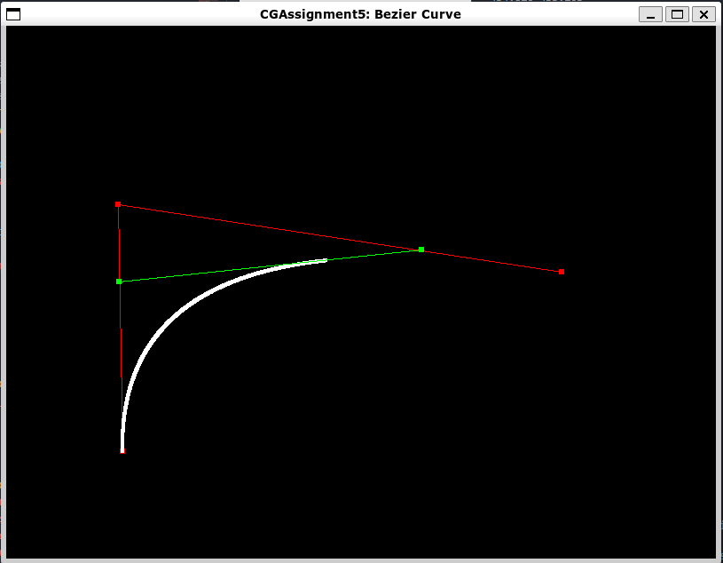

# Assignment 5: Bézier Curve

|  姓名  |   学号   |
| :----: | :------: |
| 黄灿彬 | 20337039 |

## Task 1

Bézier 曲线的定义公式如下所示，其中 $P_i$ 为第 $i$ 个控制顶点：

$$
\begin{array}{c}
Q(t)=\sum_{i=0}^{n} P_{i} B_{i, n}(t), t \in[0,1] \\
B_{i, n}(t)=\frac{n !}{i !(n-i) !} t^{i}(1-t)^{n-i}, i=0,1, \ldots, n
\end{array}
$$

我们要完成的函数是输入控制顶点序列 `points` 和 `t`，根据上面的公式计算给定 `t` 下的 Bézier 点。

$B_{i, n}(t)$ 的公式中有很多的阶乘和幂运算，而我们需要计算 $i$ 从 $0$ 到 $n$ 时的 $B_{i, n}(t)$，我们在循环中计算这些阶乘和幂时可以利用上一次迭代的中间结果，代码如下：

```C++
Point2D BezierCurve::implementTask1(const std::vector<Point2D> &points, const double &t) const
{
	//Task1: implement Bezier curve generation algorithm accroding to the definition
    int n = points.size() - 1;
	double i_factorial = 1;
	double n_factorial = 1;
    for (int j = 1; j <= n; ++j) n_factorial *= j;
    double n_minus_i_factorial = n_factorial;
    double pow_t = 1;
    double pow_1_minus_t = std::pow(1 - t, n);
	Point2D qt = { 0, 0 };

    for (int i = 0; i <= n; ++i) {
		if (i != 0) i_factorial *= i;

		double bt = n_factorial / (i_factorial * n_minus_i_factorial) * pow_t * pow_1_minus_t;
		qt.x += bt * points[i].x;
		qt.y += bt * points[i].y;

        if (n - i != 0) n_minus_i_factorial /= n - i;
		pow_1_minus_t /= 1 - t;
		pow_t *= t;
    }
    return qt;
}

```

结果如下：



[视频演示](./Video/Task1.mp4)
