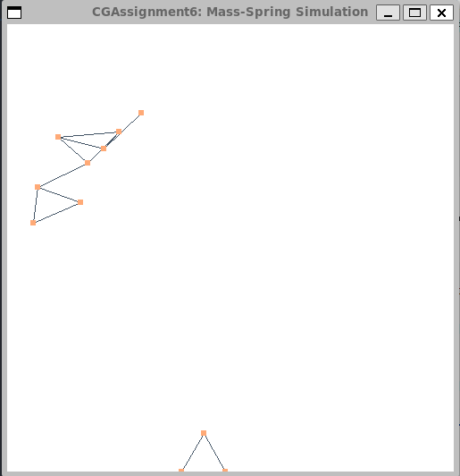

# Assignment 6: Mass-Spring Simulation

|  姓名  |   学号   |
| :----: | :------: |
| 黄灿彬 | 20337039 |

## Task 1 使用显式积分法实现质点弹簧系统的动画仿真

只需根据

$$
\boldsymbol{f}_{ij}=k\left(l_{ij}-\|\boldsymbol{x}_i-\boldsymbol{x}_j\|\right){\boldsymbol{x}_i-\boldsymbol{x}_j\over\|\boldsymbol{x}_i-\boldsymbol{x}_j\|},j=0,1,\cdots,i-1,i+1,\cdots,N
$$

求出与质点 $i$ 相连的其他质点对 $i$ 的作用力，并将它们求和，再加上 $i$ 本身受到的重力，就能够得到 $i$ 受到的合力 $\boldsymbol{f}_i$。

然后再根据

$$
\boldsymbol{v}_{t+1}=\boldsymbol{v}_t+\Delta t{\boldsymbol{f}\over m_t}
$$

$$
\boldsymbol{x}_{t+1}=\boldsymbol{x}_t+\Delta t\boldsymbol{v}_t
$$

更新 $i$ 的速度和位置即可。

代码如下：

```C++
static constexpr float dt = 0.0001f;
static glm::vec2 gravity = glm::vec2(0.0f, -9.8f);

for (unsigned int i = 0; i < m_numParticles; ++i) {
    glm::vec2 force = gravity * m_particleMass;

    for (unsigned int j = 0; j < m_numParticles; ++j) {
        if (m_restLength[i][j] != 0) {
            force += m_stiffness * (m_restLength[i][j] - glm::distance(m_x[i], m_x[j])) * (m_x[i] - m_x[j]) / glm::distance(m_x[i], m_x[j]);
        }
    }
    // Update the m_x[i]
    if (i != 0) m_x[i] += dt * m_v[i];
    // Update the m_v[i]
    m_v[i] += dt * force / m_particleMass;
}
```

结果如下：



[演示视频](./Video/Task1.mp4)

## Task 2 使用半隐式积分法实现质点弹簧系统的动画仿真

原理与 Task 1 相似，只不过把 $\boldsymbol{x}_{t+1}$ 的更新公司换成了

$$
\boldsymbol{x}_{t+1}=\boldsymbol{x}_t+\Delta t\boldsymbol{v}_{t+1}
$$

代码如下：

```C++
static constexpr float dt = 0.0001f;
static glm::vec2 gravity = glm::vec2(0.0f, -9.8f);

for (unsigned int i = 0; i < m_numParticles; ++i) {
    glm::vec2 force = gravity * m_particleMass;
    for (unsigned int j = 0; j < m_numParticles; ++j) {
        if (m_restLength[i][j] != 0) {
    	    force += m_stiffness * (m_restLength[i][j] - glm::distance(m_x[i], m_x[j])) * (m_x[i] - m_x[j]) / glm::distance(m_x[i], m_x[j]);
        }
    }
    // Update the m_v[i]
    m_v[i] += dt * force / m_particleMass;
    // Update the m_x[i]
    if (i != 0) m_x[i] += dt * m_v[i];
}
```

结果如下：


[演示视频](./Video/Task2.mp4)

## Task 3 按照给定阻尼系数衰减质点速度

为了模拟现实中质点动能因摩擦而减小的效果，使用以下衰减公式对速度进行衰减：

$$
\boldsymbol{v}=\boldsymbol{v}\cdot e^{-\Delta t\cdot \mu}
$$

其中，$\mu$ 是阻尼系数。

在更新质点位置之前使用上述公式衰减质点速度：

```C++
...
// Update the m_v[i]
m_v[i] += dt * force / m_particleMass;
// Decay the m_v[i]
double e = 2.71828;
m_v[i] *= std::pow(e, -dt * m_damping);
// Update the m_x[i]
if (i != 0) m_x[i] += dt * m_v[i];
...
```

由于加了阻尼，弹簧的震荡会逐渐衰减，最终停下来，效果如下：


[视频演示](./Video/Task3.mp4)

## Task 4 修改弹簧刚度系数

弹簧的刚度系数 `m_stiffness` 定义在头文件 `Utils.h` 中，修改后效果如下：

| 刚度系数       | 2000                                     | 4000                                     | 8000                                     | 16000                                    |
| -------------- | ---------------------------------------- | ---------------------------------------- | ---------------------------------------- | ---------------------------------------- |
| **效果** |  |  |  |  |

弹簧的刚度系数越大，受到相同大小的力时形变量越小，质点的震动幅度也就越小；最终停下来时，由于质点受到相同大小的重力，刚度系数越小的弹簧长度越长。
